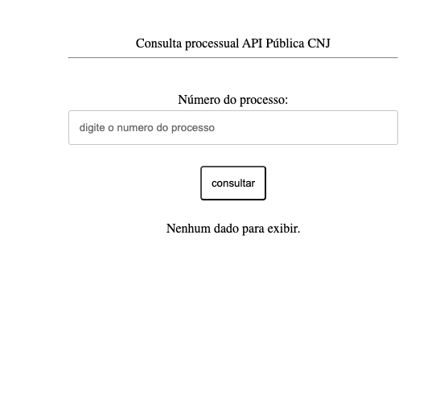
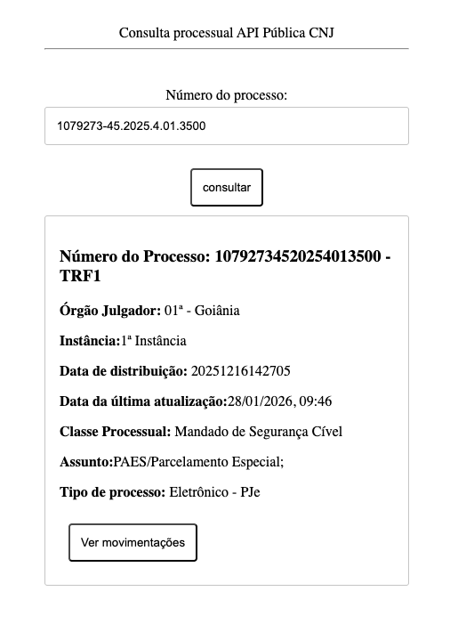
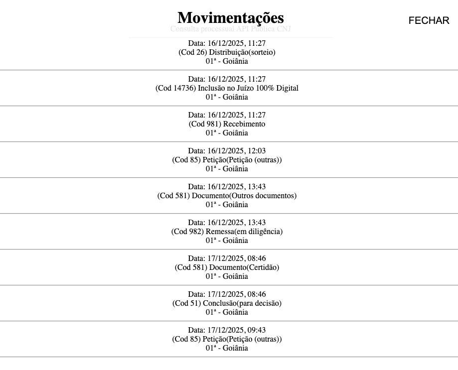

# webapp using React and Node.js for CNJ request of judicial process information

- The CNJ (conselho nacional de Justiça), judicial agency of Brazil Judicial Court, provide a API to request information about process in all courts of the country
- This webapp use this API to request and present this information to the user
- The doc about this public API is in: https://datajud-wiki.cnj.jus.br/api-publica/

## lib and dependences
This project use react in frontend and node in backend
There was no dependences

## Install
- install NodeJS (i'm using 24.13.0)
- install react components
- npm install

## Backend NodeJS

- When a process number is filled and click "consultar", frontend run the function handleSubmit.
- If validateProcess is true, make a fetch to the backend with the number of process
- In the backend, is executed the function getEndPointApi() witch return the endpoint where this process can be consult.
- It make a request for each endpoint and save the data in array named result to return to frontend
- When the result came back, it fill the dadosProcesso with setDadosProcesso.
- When the state dadosProcesso has some data, it render the component ProcessCard with data of each process.
- this component is a card with the major information about it
- Render a button to call the movements.
- When the user click in this button, the movements are inser in useState movimentos, with setMovimentos, with render a modal contain all movements that API return.

## Frontend react Components
The compoments created for this project are:
- InputText (input type text component with label element)
- button (submit button for the form)
- ProcessCard (create a card of each process)
- ModalMovimentos (create a modal with the movements of the process)

The components can recieve proprieties for better use

- ProcessCard
Recieve: process (all information that API return), tribunal (name of the court), setMovimentos (setMovimentos function to fill movimentos useState)

- ModalMOvimentos
Recieve: Movimentos (all moviments about this process that api return), setClose (useState to empty the useState and unrender the modal)

- InputText
Recieve: Id, label, placeholder, label and props (other HTML configurations, like enable)

- Button
Recieve: id, text (text that the button will show)

## how to use
1. Fill the process number (ex: 1079273-45.2025.4.01.3500)

2. When click "consultar", wait for the render of the card 

3. Click in "ver movimentações" to render the modal with the moviments

